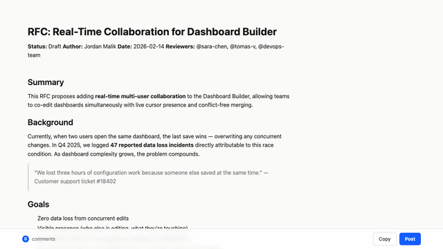

# md-review

Browser-based markdown annotation tool with Google Docs-style margin comments.

Select text, add comments, click "Done & Copy" — feedback is copied to
clipboard.



## Install

### With Bun

Clone, build, and link globally:

```sh
git clone <repo-url> && cd md-review
bun install && bun run build
bun link
```

`bun link` adds `md-review` to `~/.bun/bin/`, making it available from any
directory. Ensure `~/.bun/bin` is in your `PATH` (the Bun installer adds this
automatically):

```sh
# Verify it's on your PATH
which md-review
```

To uninstall:

```sh
bun unlink md-review
```

## Usage

```sh
md-review document.md
```

Opens the document in your browser. Select text to add comments.

### Agent integration

```sh
md-review install-skill
```

Installs a Claude Code skill to `~/.claude/skills/md-review.md`.

## Features

- Google Docs-style margin comments aligned to annotated text
- System theme — follows `prefers-color-scheme` automatically
- Syntax highlighting via highlight.js
- Mermaid diagram rendering
- "Done & Copy" copies feedback without closing the window
- Single-file build — entire UI served as one HTML file

## Development

```sh
bun install
bun run dev      # Vite dev server
bun run build    # Build dist/index.html
```
