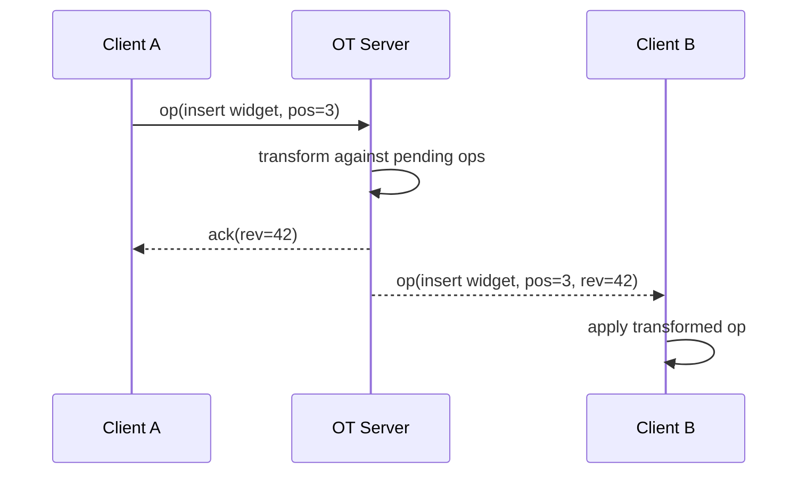

> **Note:** This is a fictional document generated by AI for demo purposes only. All names, companies, data, and technical decisions are invented.

# RFC: Real-Time Collaboration for Dashboard Builder

**Status:** Draft
**Author:** Jordan Malik
**Date:** 2026-02-14
**Reviewers:** @sara-chen, @tomas-v, @devops-team

---

## Summary

This RFC proposes adding **real-time multi-user collaboration** to the Dashboard Builder, allowing teams to co-edit dashboards simultaneously with live cursor presence and conflict-free merging.

## Background

Currently, when two users open the same dashboard, the last save wins — overwriting any concurrent changes. In Q4 2025, we logged **47 reported data loss incidents** directly attributable to this race condition. As dashboard complexity grows, the problem compounds.

> "We lost three hours of configuration work because someone else saved at the same time." — Customer support ticket #18402

## Goals

- Zero data loss from concurrent edits
- Visible presence (who else is editing, what they're touching)
- Sub-200ms latency for propagating changes to collaborators
- Graceful degradation when WebSocket is unavailable (fall back to polling)

## Non-Goals

- Version history / undo across sessions (tracked separately in [DASH-991])
- Collaborative commenting or annotation (future RFC)
- Mobile support in this iteration

---

## Proposed Architecture

### Overview

We'll use **Operational Transformation (OT)** over a persistent WebSocket connection, with a central authority server resolving conflicts.

```
Client A ──┐
           ├──► OT Server ──► Broadcast ──► Client A, B, C
Client B ──┘
```

### Data Flow



### Components

| Component | Responsibility | Owner |
|---|---|---|
| `ot-server` | Op transform, history log, broadcast | Platform team |
| `ws-gateway` | WebSocket lifecycle, auth, rate limiting | Infra team |
| `dashboard-client` | Local op queue, cursor sync, UI indicators | Frontend team |
| `presence-service` | Who's online, avatar positions | Frontend team |

---

## API Design

### WebSocket Events

**Client → Server**

```ts
// Join a dashboard session
{ type: "join", dashboardId: string, userId: string, rev: number }

// Submit an operation
{ type: "op", op: Operation, rev: number }

// Update cursor/selection
{ type: "presence", widgetId: string | null, action: "focus" | "blur" }
```

**Server → Client**

```ts
// Acknowledge a submitted op
{ type: "ack", rev: number }

// Incoming op from another user
{ type: "op", op: Operation, rev: number, userId: string }

// Presence update
{ type: "presence", userId: string, widgetId: string | null, color: string }
```

### Operation Schema

```ts
type Operation =
  | { kind: "insert"; widgetId: string; position: number; data: WidgetConfig }
  | { kind: "delete"; widgetId: string }
  | { kind: "update"; widgetId: string; patch: Partial<WidgetConfig> }
  | { kind: "move";   widgetId: string; position: number }
```

---

## Rollout Plan

### Phase 1 — Internal Beta (Week 1–2)

- [ ] Deploy `ot-server` behind feature flag
- [ ] Enable for internal Acme Corp dashboards only
- [ ] Instrument latency + error rate metrics

### Phase 2 — Opt-in GA (Week 3–4)

- [ ] Expose toggle in dashboard settings: "Enable live collaboration"
- [ ] Send email announcement to power users (>50 dashboards)
- [ ] Monitor memory usage on `ot-server` under load

### Phase 3 — Default On (Week 5+)

- [ ] Enable for all new dashboards
- [ ] Migrate existing dashboards with zero-downtime script
- [ ] Deprecate legacy save-on-close flow

---

## Risks & Mitigations

| Risk | Likelihood | Impact | Mitigation |
|---|---|---|---|
| OT bugs cause data corruption | Low | High | Fuzzing test suite + daily snapshot backups |
| WebSocket infra can't handle load | Medium | High | Load test to 10k concurrent sessions before GA |
| Users confused by presence indicators | Medium | Low | UX copy + short onboarding tooltip |
| Memory leak in long-lived sessions | Low | Medium | 24h session TTL + graceful reconnect |

---

## Alternatives Considered

### CRDTs (e.g., Yjs, Automerge)

CRDTs offer peer-to-peer merging without a central server. We evaluated **Yjs** but ruled it out for this iteration because:

1. Dashboard widget configs are not purely text — they're typed JSON trees, and CRDT semantics for map deletions can be surprising.
2. We'd still need a server for persistence and presence; the added CRDT complexity wasn't justified.
3. The team lacks CRDT expertise. OT is better documented for our use case.

CRDTs remain the right long-term answer if we eventually want offline-first support.

### Pessimistic Locking

Lock the dashboard when anyone is editing. Simple to implement, but completely blocks collaboration — ruled out immediately.

---

## Open Questions

1. **Session recovery:** If a client disconnects mid-edit for >30s, should we auto-save their local queue or discard it?
2. **Presence color assignment:** Random from a palette, or user-profile color?
3. **Rate limiting:** What's a reasonable op/s limit per user before we start dropping or batching?

---

## Success Metrics

- P99 op-propagation latency < 200ms at 500 concurrent users
- Zero data-loss incidents attributable to concurrent edits (30-day post-launch window)
- Collaboration feature adoption: 30% of active teams use it within 60 days

---

*Questions or feedback? Leave a comment or ping `#dashboard-platform` in Slack.*
